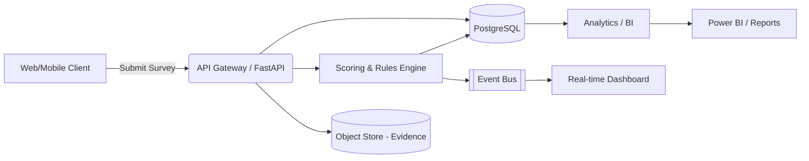

# Architecture Overview

## Goals
- Digitize end-to-end Mystery Shopper workflow (submission -> review -> analytics -> actions)
- Scalable, secure, bilingual, auditable
- Modular to integrate with BI, CRM, Identity (UAE Pass / Azure AD B2C)

## High-Level Components
1. Presentation Layer (Web + future Mobile)
2. API Layer (FastAPI) with authentication & RBAC
3. Data Layer (PostgreSQL primary, S3/Object for evidence, Redis cache)
4. Analytics & Reporting (Materialized views, Power BI export, real-time metrics)
5. Scoring & Rules Engine (weighting, KPI thresholds, alerts)
6. Admin Console (question bank mgmt, schedules, user roles, escalation matrix)
7. Integration Layer (webhooks / message bus for downstream systems)

## Request Flow
User submits visit -> API validates -> persists -> scoring engine calculates KPIs -> event emitted -> dashboards update.

## Data Model (Initial Simplified)
- Shopper(id, alias, status)
- SurveyTemplate(id, version, channel, active_from)
- Question(id, template_id, text_en, text_ar, weight, category)
- Submission(id, template_id, shopper_id, location_code, channel, visit_datetime, created_at)
- SubmissionScore(id, submission_id, question_id, raw_score, weighted_score, comment)
- KPIResult(id, submission_id, kpi_code, value)
- Alert(id, submission_id, type, severity, status)

## Security
- OAuth2 / OIDC integration (Azure AD / UAE Pass) for staff & shoppers
- JWT access tokens; refresh token rotation
- Role examples: Shopper, QA Analyst, Program Manager, Regulator Viewer, System Admin
- Field-level audit (created_by, updated_by, timestamps, trail table)

## Scalability
- Stateless API pods behind load balancer
- Async tasks (Celery / RQ) for heavy analytics
- Read replicas for reporting

## Multi-language & Accessibility
- All text stored with i18n keys; runtime locale switch (EN/AR) with RTL support
- WCAG 2.1 AA compliance

## Future Enhancements
- Mobile offline capture
- Predictive anomaly detection (ML)
- Sentiment analysis for free-text comments
- Auto-escalation workflows (ServiceNow / email)

