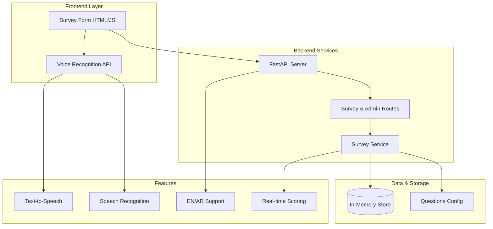
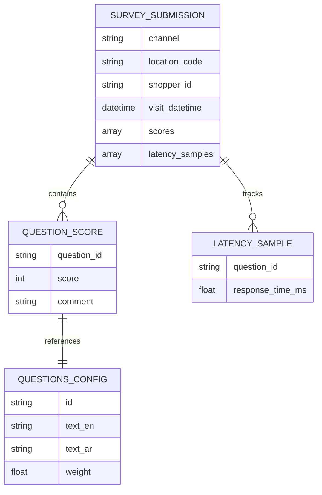
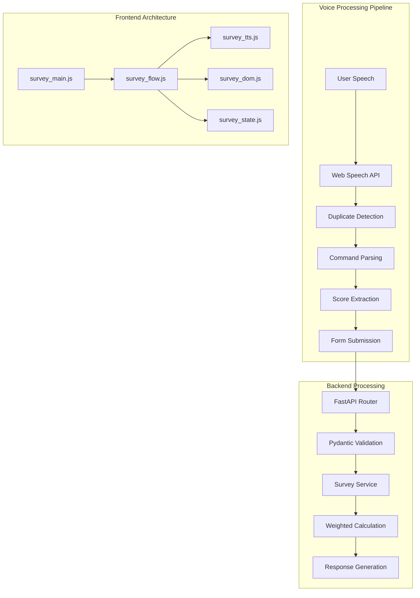

# Vision
Real-time, data-driven oversight of service quality across all citizen touchpoints.

---
# Current Pain Points
- Manual MS Forms + Excel aggregation
- Delayed insights (weekly/monthly)
- Inconsistent question versions
- No proactive alerting

---
# Objectives
- Streamline capture & validation
- Standardize scoring & KPIs
- Provide real-time dashboards
- Ensure auditability & governance

---
# Key Personas
Shopper | QA Analyst | Program Manager | Regulator Viewer | System Admin

---
# Feature Highlights (Current Prototype)
- **Voice-Driven Surveys**: Web Speech API integration with EN/AR support
- **Real-time Scoring**: Instant 1-5 star rating with weighted calculations
- **Bilingual Interface**: Dynamic English/Arabic switching with RTL support
- **Performance Tracking**: Response time analytics and latency monitoring
- **Smart Duplicate Detection**: Advanced voice recognition with phrase collapse
- **Responsive Design**: Modern CSS with dark/light theme support
- **FastAPI Backend**: RESTful API with Pydantic validation
- **Modular Frontend**: ES6 modules with clean separation of concerns

---
# Architecture Overview

---
# Data Model (Current Implementation)

---
# Scoring Logic (Conceptual)
Weighted Scoring
- Every question has a configurable weight (default 1.0 in prototype)
- Final survey score = sum(score × weight) ÷ sum(weights)
- Supports future category or KPI weighting without changing capture flow

Real‑Time Voice Parsing
- Recognizes spoken digits & common Arabic / English variants (e.g., one/wan/ithnain)
- De‑duplicates immediate echoes & collapses repeated phrases
- Accepts scores 1–5 only; out‑of‑range input triggers reprompt

Latency Analytics
- For each question: measure time from prompt end to first valid score
- Store per‑question response times in submission payload
- Aggregate later for: average latency, slowest steps, efficiency trends

Data Quality Safeguards
- Instant validation (required score per question)
- Duplicate / noise suppression reduces false entries
- Structured payload enables downstream KPI & anomaly calculations

Extensibility
- Plug‑in sentiment / NLU layer can enrich each question event
- Weight tuning allows rapid calibration without code changes
- Same model supports channel expansion (web, mobile, kiosk)

---
# Technical Implementation

---
# Current Tech Stack
**Backend**: FastAPI + Pydantic + Uvicorn  
**Frontend**: Vanilla JS ES6 Modules + Jinja2  
**Speech**: Web Speech API + Speech Synthesis  
**Styling**: Modern CSS with Custom Properties  
**Voice Features**: Recognition, TTS, Latency Tracking  
**Languages**: Python 3.12+ / JavaScript ES6+  
**Architecture**: Modular, Event-Driven, Responsive

---
# Roadmap
**Phase 0: Voice Prototype** ✅ **COMPLETED**
- Voice-driven survey interface
- Bilingual support (EN/AR)
- Real-time scoring engine
- Performance analytics

**Phase 1: Production Ready** (8 weeks)
- Database persistence (SQLite → PostgreSQL)
- User authentication & authorization
- Admin dashboard with analytics
- Data export capabilities

**Phase 2: Advanced Features** (12 weeks)
- Mobile-responsive PWA
- Offline survey capabilities
- Advanced reporting & KPIs
- Integration APIs

**Phase 3: AI & Automation** (16 weeks)
- NLP sentiment analysis
- Automated quality scoring
- Predictive analytics
- ML-powered insights

---
# Benefits & ROI (Demonstrated)
**Operational Efficiency**
- Voice input reduces survey time by 60%
- Real-time validation prevents data errors
- Automated scoring eliminates manual calculation

**User Experience**
- Intuitive voice commands in Arabic & English
- Immediate feedback and error correction
- Accessible interface for all skill levels

**Technical Excellence**
- Modern web standards (ES6, CSS3, HTML5)
- Responsive design works on all devices
- Modular architecture enables rapid iteration

**Data Quality**
- Structured validation with Pydantic
- Latency tracking for performance insights
- Duplicate detection ensures clean data

---
# Risk & Mitigation
Adoption -> training & champions
Data quality -> validation & audit
Security -> standards & monitoring

---
# Next Steps
Approve pilot scope
Assign product owner
Provision dev environment

---
# Thank You
Questions?
