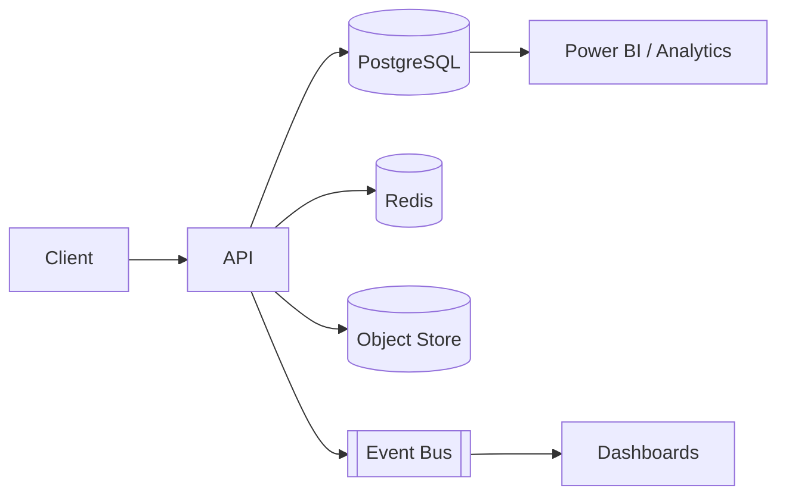

# Vision
Real-time, data-driven oversight of service quality across all citizen touchpoints.

---
# Current Pain Points
- Manual MS Forms + Excel aggregation
- Delayed insights (weekly/monthly)
- Inconsistent question versions
- No proactive alerting

---
# Objectives
- Streamline capture & validation
- Standardize scoring & KPIs
- Provide real-time dashboards
- Ensure auditability & governance

---
# Key Personas
Shopper | QA Analyst | Program Manager | Regulator Viewer | System Admin

---
# Feature Highlights (MVP)
- Dynamic survey templates
- Weighted scoring engine
- Role-based access (OIDC)
- Bilingual (EN/AR) UI with RTL
- Basic analytics & exports

---
# Architecture Overview

---
# Data Model (Simplified)
Submission -> Scores -> KPIs -> Alerts

---
# Scoring Logic
Weighted Composite = Σ(score * q_weight * channel_weight) / Σ(q_weight * channel_weight)

---
# Roadmap
Phase 0: Prototype (Now)
Phase 1: Core Platform (12 wks)
Phase 2: Advanced Analytics (8 wks)
Phase 3: Mobile & ML (12 wks)

---
# Benefits & ROI
- Faster remediation
- Higher customer satisfaction
- Operational efficiency
- Regulatory transparency

---
# Risk & Mitigation
Adoption -> training & champions
Data quality -> validation & audit
Security -> standards & monitoring

---
# Next Steps
Approve pilot scope
Assign product owner
Provision dev environment

---
# Thank You
Questions?
